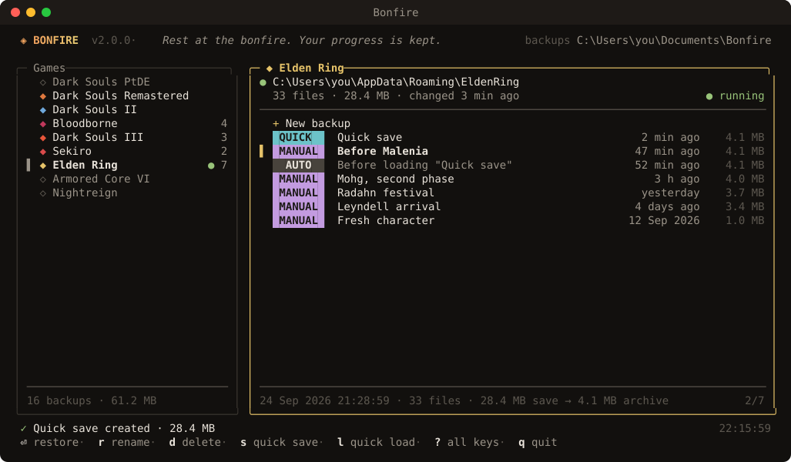
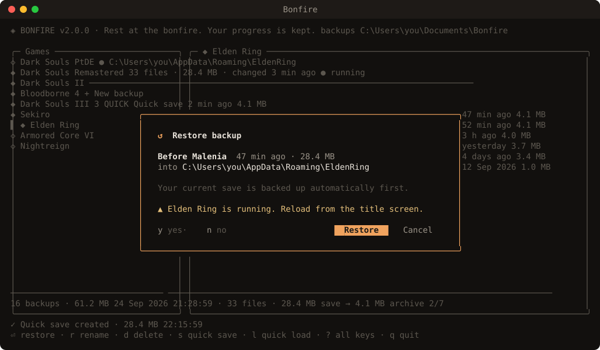

<p align="center">
  
</p>

<h1 align="center">Bonfire</h1>

<p align="center">
  <i>Rest at the bonfire. Your progress is kept.</i>
</p>

<p align="center">
  Save backups for FromSoftware games, in a terminal UI.<br>
  One small <code>.exe</code>: no installer, no runtime.
</p>

<p align="center">
  <a href="https://github.com/rsxcore/Bonfire/releases/latest"></a>
  <a href="https://github.com/rsxcore/Bonfire/actions/workflows/ci.yml"></a>
  
  <a href="LICENSE"></a>
</p>

<p align="center">
  
</p>

## Features

- **Quick save and quick load.** Press <kbd>s</kbd> before a boss, press <kbd>l</kbd> after you die.
- **Named backups** for the moments you want to keep: *Before Malenia*, *Radahn festival*.
- **Every load can be undone.** Your current save is archived automatically before anything is restored.
- **Finds your saves.** It detects every supported game, including Bloodborne in any region under shadPS4.
- **Knows when a game is running** and warns you before restoring over it.
- **Verified restores.** Each file is checked against its SHA-256 before your save is touched.

## Supported games

| Game | Save folder |
|---|---|
| Dark Souls: Prepare to Die Edition | `Documents\NBGI\DarkSouls` |
| Dark Souls Remastered | `Documents\NBGI\DARK SOULS REMASTERED` |
| Dark Souls II / Scholar of the First Sin | `%AppData%\DarkSoulsII` |
| Bloodborne (shadPS4) | `%AppData%\shadPS4\savedata\…`, or point it at a portable shadPS4 folder |
| Dark Souls III | `%AppData%\DarkSoulsIII` |
| Sekiro: Shadows Die Twice | `%AppData%\Sekiro` |
| Elden Ring | `%AppData%\EldenRing` |
| Armored Core VI | `%AppData%\ArmoredCore6` |
| Elden Ring Nightreign | `%AppData%\Nightreign` |

Saves somewhere else? Select the game and press <kbd>p</kbd> to set its folder.

## Install

Download **`Bonfire.exe`** from the [latest release](https://github.com/rsxcore/Bonfire/releases/latest) and run it. It looks best in [Windows Terminal](https://aka.ms/terminal), the default terminal on Windows 11.

## Usage

| Key | Action |
|---|---|
| <kbd>↑</kbd> <kbd>↓</kbd> | Move |
| <kbd>Enter</kbd> | Open a game → **+ New backup** → name it → done |
| <kbd>Enter</kbd> on a backup | Restore it |
| <kbd>s</kbd> / <kbd>F5</kbd> | Quick save: one slot per game, replaced each time |
| <kbd>l</kbd> / <kbd>F9</kbd> | Quick load |
| <kbd>r</kbd> / <kbd>d</kbd> | Rename / delete a backup |
| <kbd>o</kbd> / <kbd>b</kbd> | Open the save folder / backups folder |
| <kbd>p</kbd> | Set a custom save folder |
| <kbd>,</kbd> | Settings |
| <kbd>?</kbd> | All keys |

<p align="center">
  
</p>

## How your saves stay safe

| | |
|---|---|
| **Undoable loads** | Before a restore, the current save is kept as an `AUTO` backup, unless an identical backup already exists. The newest 10 per game are kept (configurable). |
| **Verified** | Every backup stores a SHA-256 of each file. A restore extracts to a staging folder and checks every file before swapping it in. A damaged archive never touches your save. |
| **All-or-nothing** | If the game holds a save file open, the restore is cancelled and your save stays exactly as it was. Nothing is ever half replaced. |
| **Crash-safe** | Backups are written to a temporary file and renamed into place, so a crash can't leave a broken archive. |

Backups are ordinary `.zip` files in `Documents\Bonfire\<game>\` with a `manifest.json` inside, so you can open them without Bonfire. Settings live in `%AppData%\Bonfire\config.json`.

## Building from source

Requires [Go 1.26+](https://go.dev/dl/).

```powershell
git clone https://github.com/rsxcore/Bonfire
cd Bonfire
.\build.ps1                 # runs the tests, embeds the icon, writes dist\Bonfire.exe
.\build.ps1 -Version 2.1.0  # stamps a version
```

Pushing a `v*` tag builds the exe and publishes a GitHub release.

<details>
<summary>Project layout</summary>

```
main.go               entry point
internal/store        zip archives, manifests, verified restore
internal/manager      quick save/load, undoable restores, save detection
internal/games        supported games and their save locations
internal/ui           terminal UI (Bubble Tea + Lip Gloss)
internal/sys          Windows folders and process list
tools/genres          draws the icon, embeds it and the version into the exe
```

</details>

## History

Bonfire started in 2024 as **Simple Save Manager**, a C# console app by [@shisuimanson](https://github.com/shisuimanson). In 2026 it was rewritten from scratch in Go. The original code, with its bugs fixed, is kept on the [`legacy`](https://github.com/rsxcore/Bonfire/tree/legacy) branch.

## License

[MIT](LICENSE). Bonfire is a fan project and isn't affiliated with FromSoftware or Bandai Namco.

## Support

If Bonfire saved your run, you can buy me a coffee:

<p align="center">
  <a href="https://ko-fi.com/rsxcore"></a>
</p>
